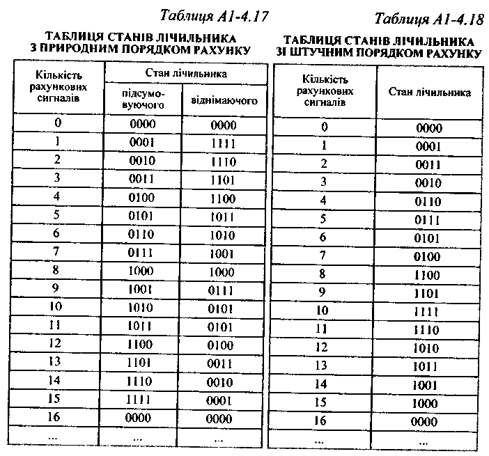
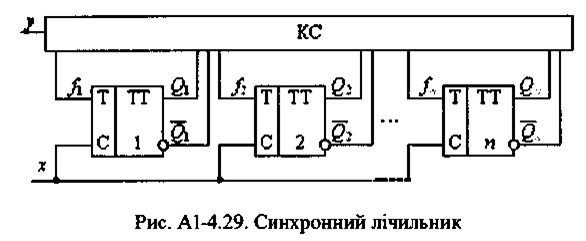
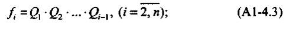
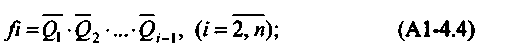
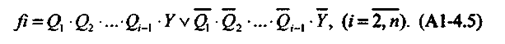

# Тема: Дослідження роботи лічильників

## 📘 Теоретичні відомості

Лічильником називають послідовну схему (регістр), призначену для виконання мікрооперацій підрахунку сигналів.

- **Кількість дозволених станів** лічильника називають його *періодом*, *модулем* або *коефіцієнтом перерахування* **К**.
- Лічильники можуть бути побудовані на основі тригерів зі спеціальними міжрозрядними зв'язками.

#### Види лічильників за характером рахунку:
- **Підсумовуючі** – вміст збільшується на 1 при кожному вхідному сигналі `x`.
- **Віднімаючі** – вміст зменшується на 1 при кожному вхідному сигналі `x`.
- **Реверсивні** – виконують додавання або віднімання залежно від сигналу на керуючому вході `y`:
  - `y = 1` – підсумовування;
  - `y = 0` – віднімання.

#### Класифікація за схемними ознаками:
- **Асинхронні лічильники**:
  - Тригери спрацьовують не одночасно;
  - Низька швидкодія через послідовне переключення.

- **Синхронні лічильники**:
  - Усі тригери переключаються одночасно;
  - Діє загальний синхронізуючий сигнал, що надходить на тактуючі входи одночасно.

#### Побудова ланцюгів переносів:
- У лічильниках з **паралельним переносом**:
  - Аргументами функцій переносів для кожного розряду є тільки сигнали на виходах відповідних тригерів;
  - Переноси формуються одночасно, за умови однакового часу переключення всіх логічних елементів.

#### Ланцюги переносу в лічильниках

- **Ланцюги наскрізного переносу**:
Функція переносу *i-го* розряду є аргументом для *переносу (i+1)-го* розряду.
Переноси формуються **почергово**, починаючи з молодших розрядів.
Вимагають меншого числа логічних елементів організації ланцюгів переносу.

- **Ланцюги з груповим переносом**:
Розряди розбиваються на групи (наприклад, `n` розрядів → `m` груп).
Усередині групи використовується рівнобіжний перенос.
Між групами — послідовний або наскрізний перенос.

#### Природний та штучний порядок рахунку

- **Природний порядок рахунку**:
Мікрооперація рахунку одиниць виконується у **канонічній двійковій системі**.
Використовується **однорідна позиційна система** з природним порядком ваг.
Наприклад: стани чотирирозрядного лічильника з природним порядком наведено в _табл. А1-4.17_.

- **Штучний порядок рахунку**:
Рахунок виконується в **неканонічних системах** (символічних, з іншими вагами тощо).
Наприклад **код Грея**. Стани чотирирозрядного лічильника з таким рахунком наведено в _табл. А1-4.18_.

З таблиць **А1-4.17** і **А1-4.18** видно, що стани лічильників повторюються з періодом `2ⁿ`.  
Для скорочення таблиць станів зазвичай заносять **лише стани одного періоду**.

#### Побудова лічильників

Найпростіші схеми лічильників з природним порядком рахунку будуються на основі тригерів з рахунковим входом:

- **T-тригери**
- **JK-тригери**

#### Узагальнена структура синхронного лічильника

На рис. **А1-4.29** показано узагальнену структуру **синхронного лічильника** на T-тригерах.

Комбінаційна схема (КС) формує **сигнали переносів `fᵢ`**, які надходять на рахункові входи i-х тригерів.
На вхід **`x`** подаються сигнали, що підраховуються.
Вхід **`y`** визначає напрямок рахунку:
  - `y = 1` — підсумовування (додавання 1)
  - `y = 0` — віднімання (віднімання 1)

🎯 JK-тригери в лічильниках

У JK-тригерах рахунковий вхід організується шляхом з'єднання входів  `J` і `K`.

Особливості роботи:

Тригер молодшого розряду перемикається на кожен рахунковий сигнал.

Тригери старших розрядів перемикаються лише тоді, коли:

- У підсумовуючому лічильнику — всі молодші тригери в стані 1.

- У віднімаючому лічильнику — всі молодші тригери в стані 0.

🧮Формування функцій перемикання

Для підсумовуючих лічильників з природним порядком рахунку за модулем 2ⁿ (із ланцюгами паралельного переносу), перемикальні функції fᵢ мають вигляд:

- для віднімаючих лічильників:

- а для реверсивних:

